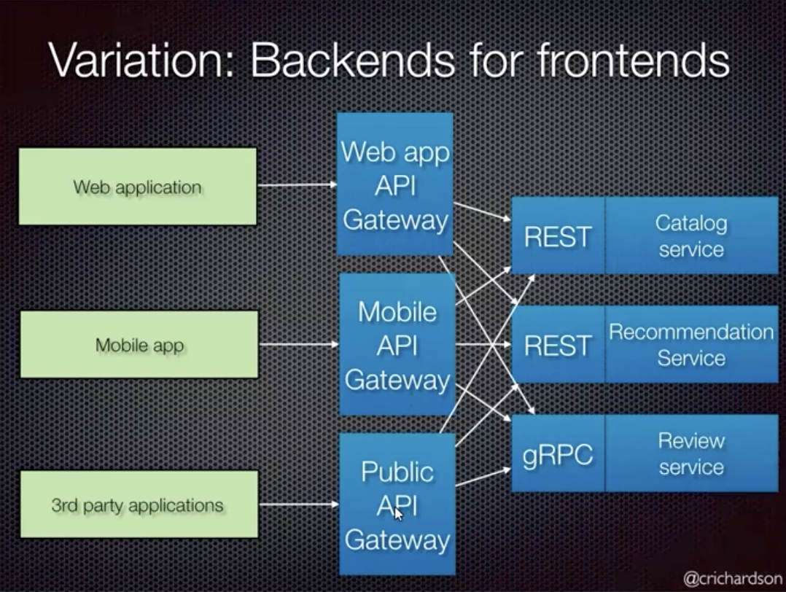

#### Tanım

API Geçidi, tüm istemci istekleri için arka uç hizmetlerine tek bir giriş noktası olarak hizmet eder.

#### Amaç

İstek yönlendime, birleştirme ve protokol çevirisini ele alarak istemci etkileşimlerini basitleştirir.

### Mikroservis Mimarisi İçindeki Rolü

- **Merkezi Nokta:** İstemcileri birden fazla mikroservisle bağlar.
- **İletişimi Basitleştirir:** Çeşitli servislerden gelen yanıtları tek bir yanıt halinde birleştirir.
- **Protokol Çevirisi:** İstemci protokollerini, servislerin dahili olarak kullandığı protokollere dönüştürür.

### API Geçitlerinin Ana Özellikleri

- **Kimlik Doğrulma ve Yetkilendirme:** İstemci kimliklerini doğrulayarak güvenliği yönetir.
- **Yük Dengeleme:** Gelen trafiği herhangi bir servisin aşırı yüklenmesini önlemek için dağıtır.
- **Önbellekleme:** Gecikmeyi azaltmak ve performans arttırmak için yanıtları saklar.
- **Hız Sınırlandırma:** Kötüye kullanımı önlemek için istek sayını kontrol eder.

### API Geçitlerini Kullanmanın Faydaları

- **Basitleştirilmiş İstemci Kodu:** İstemciler birden fazla servis yerine tek bir uç noktayla etkileşime girer.
- **Gelişmiş Güvenlik:** Kimlik doğrulama ve girdi doğrulamayı merkezi hale getirir.
- **Ölçeklenebilirlik:** Trafiği etkili bir şekilde yöneterek yatay ölçeklemeye yardımcı olur.
- **Esneklik:** Mikroservislerin istemcileri etkilemeden bağımsız olarak gelişmesine olanak tanır.

### Zorluklar ve Dikkat Edilmesi Gerekenler

- **Tek Arıza Noktası:** Geçit arızalanırsa tüm istemci istekleri etkilenir.
- **Karmaşıklık:** Yönetilmesi ve bakımı gereken ek bir katman ekler.
- **Gecikme:** Ek işlem nedeniyle yanıt süresinin potansiyel olarak artırır.

### Popüler API Geçitleri

### Kullanım Senaryoları

